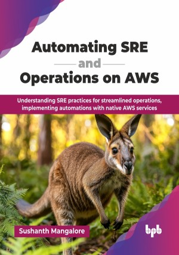

# Automating SRE and Operations on AWS

Understanding SRE practices for streamlined operations, implementing automations with native AWS services .

This is the repository for [Automating SRE and Operations on AWS
](https://bpbonline.com/products/automating-sre-and-operations-on-aws?_pos=1&_sid=a60258a8d&_ss=r&variant=44769248477384?variant=44769248477384),published by BPB Publications.

## About the Book
Reliability and efficiency are paramount in the ever-evolving cloud landscape. Whether you are an enterprise adopting cloud for the first time or have been operating in the cloud for a while, you want to ensure that you are taking advantage of automation options available to you in the cloud.

This book provides a systematic, chapter-by-chapter approach to automating every aspect of your operations on AWS. You will understand laC with AWS CloudFormation, automate continuous infrastructure maintenance, and streamline your release pipelines with a focus on DevSecOps. This book emphasizes building a culture of performing operations as code, and you will learn about the different facets of operations on AWS and the services and features available on AWS to automate many of these operational and SRE tasks. Finally, it demonstrates how to apply automation to cost management and auditing through FinOps.

By the end of this book, you will be able to apply the concepts and ideas presented in this book to your cloud operations on AWS. This will help enhance the productivity and efficiency of your organization by reducing the operational heavy lifting. You will learn to operate on AWS in the same manner as other successful cloud adopters around the world.

## What You Will Learn
• Introduction to SRE practices in the cloud. 

• Distinction between the terms SRE and DevOps.

• Differentiating operational tasks on AWS from traditional approaches.

• Automation of common operational and SRE tasks on AWS using native services and options.

• Using CloudWatch and X-ray for monitoring and distributed tracing.

• Deploying IaC and performing operations as code.

• Continuous integration and deployment, observability, and incident response for your AWS environments.

• Auditing and cost management for your AWS environment.
